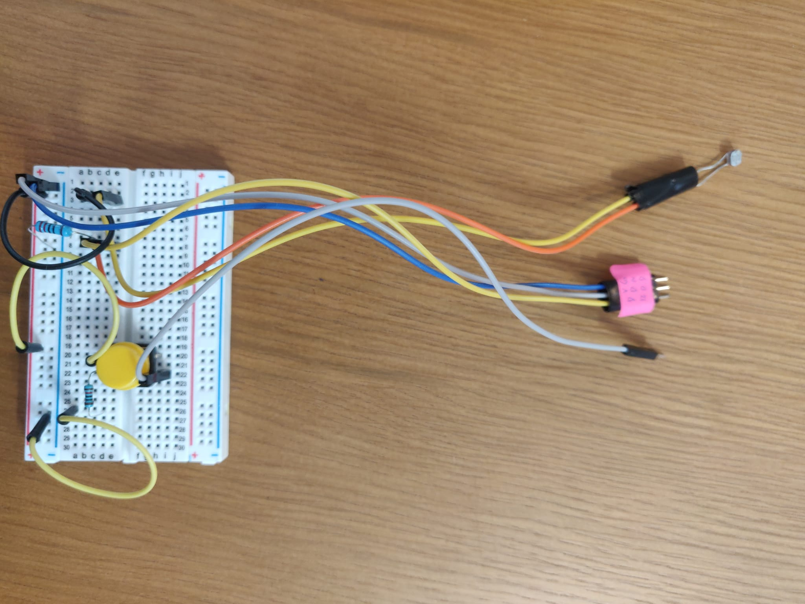
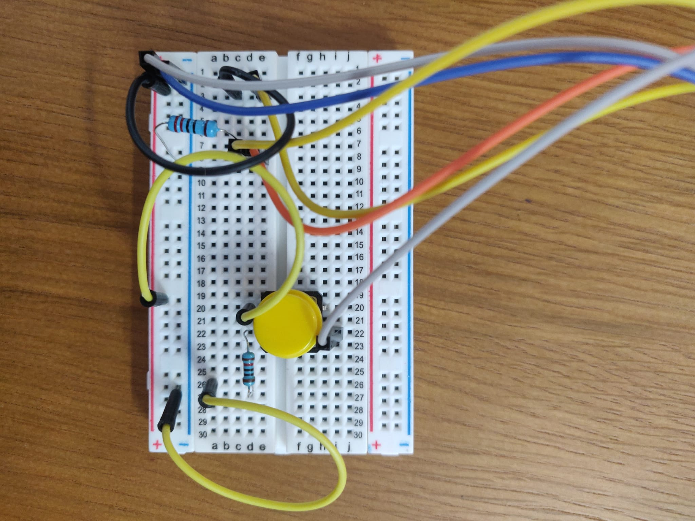
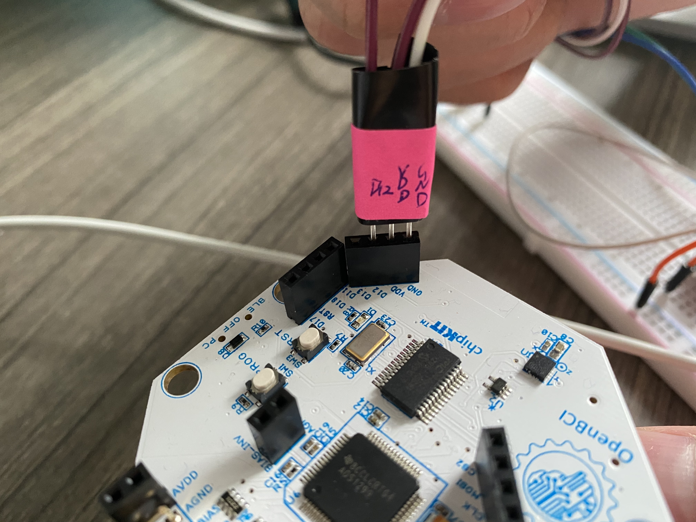

# OpenBCI_Experiment

Welcome to the OpenBCI Puppies and Kittens Experiment designed by Fan Li.

During this experiment, you will watch a video containing images of puppies and kittens, and press a button every time you see a puppy in the image.

Below are the instructions on how to do it. The full information on this experiment can be found on [Fan Li's Repository](https://github.com/Fan1117/Puppies_and_Kittens/).

## Equipment Required

1. Headwear, which can be:

- [Ultracortex Mark IV Headset](https://shop.openbci.com/products/ultracortex-mark-iv) with copper cables. 
- [Gold Cup Electrodes](https://shop.openbci.com/collections/frontpage/products/openbci-gold-cup-electrodes?variant=9056028163) with [Ten20 Paste](https://shop.openbci.com/collections/frontpage/products/ten20-conductive-paste-2oz-jars?variant=31373533198).
- [EEG Electrode Cap Kit](https://docs.openbci.com/docs/04AddOns/01-Headwear/ElectrodeCap) with [Electrode Cap Gel](https://shop.openbci.com/collections/frontpage/products/electrodegel?variant=28056992776264) and [Touch Proof Adapter](https://shop.openbci.com/collections/frontpage/products/touch-proof-electrode-cable-adapter?variant=31007211715).
2. [Cyton Board](https://shop.openbci.com/collections/frontpage/products/cyton-biosensing-board-8-channel?variant=38958638542)
2. [OpenBCI GUI](https://github.com/OpenBCI/OpenBCI_GUI/releases/tag/v5.0.0)
3. [To add external button components]

## Step 1: Headwear, Board and Software Setup

First, connect the headwear to yourself and to the Cyton board, and read from it using the GUI. If you are using the Ultracortex, follow [this tutorial](https://docs.openbci.com/docs/04AddOns/01-Headwear/MarkIV). If you're using the gold cup electrodes, follow [this guide](https://docs.openbci.com/docs/01GettingStarted/02-Biosensing-Setups/EEGSetup) to learn how to connect each electrode, and connect them in the positions you'd like to measure EEG from. A good guide to the 8 positions commonly used can be found in the Ultracortex tutorial. If you're using an electrode cap, follow [this tutorial](https://docs.openbci.com/docs/04AddOns/01-Headwear/ElectrodeCap) to connect it.

## Step 2: External Button Setup

Using the components listed above, assemble the external button on the breadboard as shown in the pictures below.




Next, connect the breadboard to the Cyton board as shown in the picture below. Place the breadboard beside your computer such that the photocell points to the lower left corner of your screen, which is where the video trigger will be located.



## Step 4: Run Experiment

Download [this video](video.mp4). Once you're ready to start, press ```Start Data Stream``` in the GUI,open the video, and make it Full-Screen. Every time a puppy appears in the video, press the button. The video is around 3 minutes long. You're now ready to press play!

## Step 5: Retrieve and Send Data

Once you've finished watching the video, press ```Stop Data Stream```. In your /Documents/OpenBCI_GUI/Recordings folder you should find the recorded data for that session. 

## Step 6: Process the Recorded Data

In [this file], you'll find sample code to read, plot, and analyze the recorded data. 


